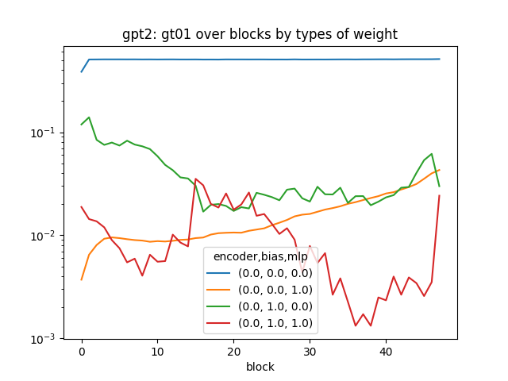
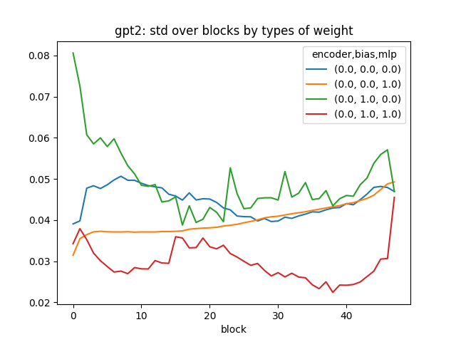
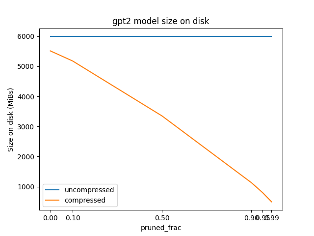
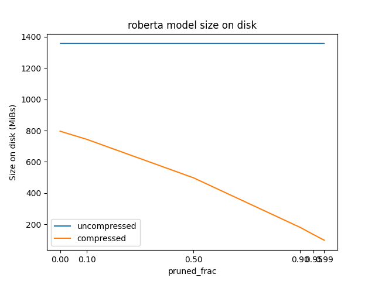
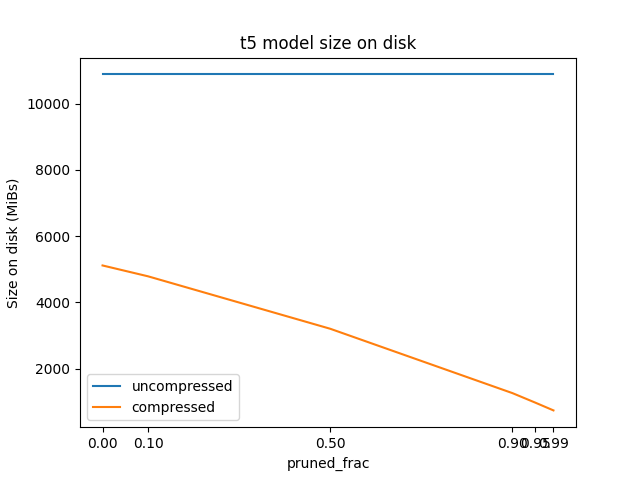
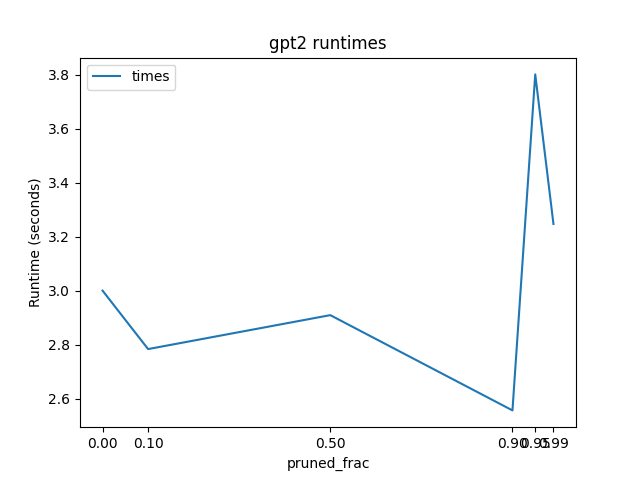
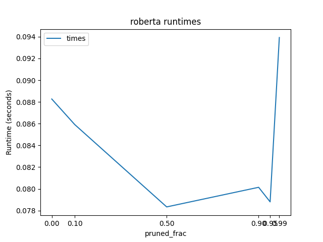
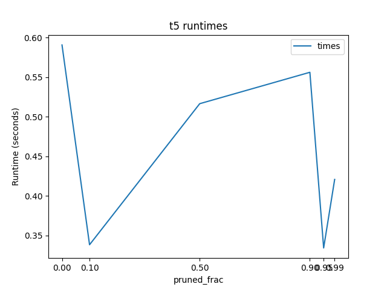

# Report

- [outline](https://oaklight.github.io/dls2022/assignments/lab%204%20sketch.pdf)

## 1

Sparsification is the process of converting a densely-connected model to a (relatively) sparse model. The goal is generally model compression - to produce a smaller model that performs inference more quickly.

Pruning is a particular type of sparsification where certain weights are removed or masked to 0 based on some heuristic, either during or after training.

Quantization is another way of performing model compression, by reducing the number of bits used to store each weight. This sacrifices precision.

Distillation is another model compression technique where a smaller model is trained to mimic the output layer of the larger model. Crucially, the smaller model is trying to learn the distribution of probabilities predicted by the teacher model - in a classification context, if there is an image of a husky we want the small model to not only learn that it should classify the image as "Husky" but also learn that the large model thinks that "Malamute" is also a fairly likely class for the image.

MoEfication (MoE stands for Mixture-of-Experts) is a technique for faster inference specific to the feedforward network portions of transformers. Rather than having one feedforward network, there are multiple smaller feedforward networks ("experts") and a router (with learned parameters) which selects suitable experts for each input. This doesn't make the model smaller but it allows the forward computation to be faster as we only have to compute the activations for the chosen experts.

## 2

Encoder-only: RoBERTa (this is only 355M parameters but it was the largest encoder-only model supported by Huggingface)
Decoder-only: GPT2 (the largest version of the model is 1.5B parameters)
Encoder-Decoder: T5-3B (3B parameters, as the name suggests)

## 3

The relevant file for this portion is 'src/param_stats.py'.

Fraction of parameters overall whose absolute values are greater than 0.1 and 1 respectively:
- GPT2: 1.842e-2, 2.400e-6
- RoBERTa: 9.441e-2, 6.754e-8
- T5: 5.346e-1, 2.357e-2

I am surprised that T5 has such large weights. I also produced some plots that measure these fractions by layer. Here's an example from GPT2:

In this plot, the y-axis is the fraction of weights with absolute values > 0.1, and the x axis is the layer (or block). Each line represents one type of weight. 'encoder' is 0 for weights from decoder layers and 1 for weights from encoder layers. 'bias' is 1 for weights from bias terms and 0 for all other weights. 'mlp' is 1 for weights that are part of the feedforward networks, and 0 for weights that are part of the attention blocks (including the linear projections).

For instance, the blue line represents weights from the non-bias (since bias is 0) attention portion (since mlp is 0) of decoder layers (since encoder=0.0; in gpt2, of course, all layers are decoder layers!). The red line, on the other hand, is weights from the bias terms in the feedforward portion of decoder layers.

In addition to plots of 'gt01' and 'gt1' (the fraction of weights whose absolute values are >= 1), I also produced plots for basic summary statistics of the distributions of weights: mean, standard deviation, skewness, and excess kurtosis, also by layer. Here's the standard deviation plot for gpt2:

The others exist under 'plots/by_layer'.

## 4

I used the built-in Pytorch L1 pruning globally. Basically it prunes the weights with the smallest absolute values across the entire model. The pruned weights are simply set to zero - pytorch doesn't actually make the matrices sparse, as at reasonable levels of pruning these matrices are a lot less sparse than sparse matrices that arise in other types of scientific computing (which sparse matrix libraries are built around).

## 5

I was trying to get the coqa dataset to run with GPT2, but I was having trouble getting it to give reasonable results in spot-checks, despite following the GPT-2 paper's instructions as closely as possible. I realized that to run it over even the development set I would need to figure out how to submit jobs to the Polaris compute nodes, but I heard from classmates that their jobs were stuck in the queue for a long time, so I decided to abort. I have a bit of spaghetti code in src/coqa.py.

## 6

Sizes of models were evaluated in src/prune.py and runtimes of models were evaluated in src/pruned_runtime.py

Below are plots of the sizes of the uncompressed and compressed models at the various sparsity levels:

It is unsurprising that the uncompressed models do not change in size - the tensors are still stored in dense format; it's just that more weights are 0. However, gzip is able to effectively compress when many values are 0. It's interesting that the compression possible on even just the base model varies so much between models.

Below are plots of the runtime (single additional token) of the models at the various sparsity levels:

These times are kind of all over the place, but don't show a very clear pattern. I tried to correct for some variation by setting the maximum new tokens to 1 and repeating 10 times (taking the average). It's possible that the unpruned value tends to be high because I measured it first. Beyond that, I think it's likely random variation. This makes sense as inference shouldn't actually be affected by this type of sparsification - it's still having to feed forward through dense weight tensors.

## 7

Many of the challenges of sparsification on LLMs are similar to challenges of sparsification in general:
- There are few techniques that can optimize "somewhat-sparse" matrices where 50-90% of the weights are zero, so currently the main benefit is in the compressed size of the model (at least with unstructured pruning. Structured pruning can lead to more benefits but in general far fewer weights can be pruned without significant performance degradation).
- We want to prune as early as possible in training to save training time/computation, but it's hard to know early on which weights are okay to prune
- Heuristics like L1 pruning are fuzzy. Also, pruning can work *against* regularization, which *penalizes* large weights.

Challenges specific to LLMs:
- Training is extremely expensive so there is little ability to play around with hyperparameters during training (and how/when to iteratively prune is a hyperparameter)
- We can prune at the end but then training isn't any cheaper
- Optimal pruning may be different between the feedforward and attention portions, and different for different layers of the model.
